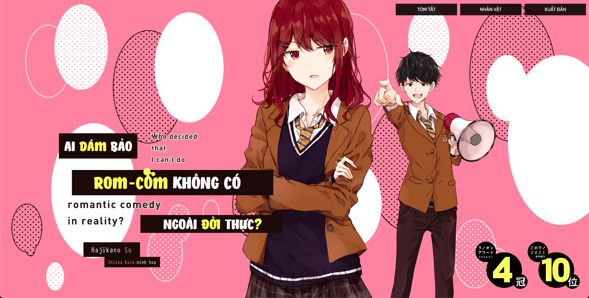

<h1 align="center">
  <br> Rabudame Web <br>
</h1>


# Info

This is a clone website [Rabudame]('http://rabudame.com/') code by [Flutter]('https://flutter.dev').

The website demo can be viewed [here]('https://viviethoang99.github.io/rabudame/').



# Bugs or Requests

If you encounter any problems feel free to open an [issue](https://github.com//jonbhanson/flutter_native_splash/issues/new?template=bug_report.md). If you feel the library is missing a feature, please raise a [ticket](https://github.com//jonbhanson/flutter_native_splash/issues/new?template=feature_request.md). Pull request are also welcome.


# Contribute (Đóng góp)

Mình không phải fan bộ này, mới chỉ đọc qua vài chương truyện tranh thôi nên phần thông tin có thể không chuẩn. Nếu các bạn có bất cứ đóng góp nào về dịch thuật nào thì mình rất hoan nghênh.

File json nằm ở assets/json/data.json hoặc tạo yêu cầu [tại đây]("https://github.com/viviethoang99/rabudame/issues/new")

1, Character profile format

```yaml
    {
      "name": "Uenohara Ayano", # Tên nhân vật
      "classmate": "10-5",  # Lớp học nhân vật
      "avatar": "assets/character/ayano.jpeg",  # Ảnh nhỏ ở phần thông tin
      "id_student": "6", # Mã số học sinh
      "character_color": "#fa98a2", # Màu của nhân vật
      "url_image": "profile_ayano.jpg", # Ảnh đầy đủ của nhân ạật
      "birthday": "10/11", # Sinh nhật. Phải theo cấu trúc "Ngày/Tháng"
      "middle_schools": "Trường trung học Bắc Kyougoku", # Trường cấp 2 đã đọc. Không biết thì để null
      "club": null, 
      "assess_suitability": "C",  # Mức độ phù hợp với rom-com. Không biết thì để null
      "profile": "Một cô nàng lạnh lùng và bình thường đã bị cuốn vào 'Kế hoạch Rom-Com ngoài đời thực' của Kohei sau một tai nạn hi hữu. Thành tích học tập và khả năng thể dục đểu xuất sắc. Mặc dù đứng thứ 7 top hoa khôi cùng khoá nhưng cô ấy không phải “nữ chính” do không có năng lực hay tính cách nổi bật.", # Thông tin của nhân vật
      "role": "Đồng phạm", # Vai trò của nhân vật
      "radar_stat": { # Chỉ số nhân vật. Từ 0 tới 100.
        "visual": 80, # Chỉ số ngoại hình. Không biết thì để null
        "basic_competency": 80, # Chỉ số năng lực. Không biết thì để null
        "personality": 60, # Chỉ số tính cách. Không biết thì để null
        "behavioral": 60, # Chỉ ôố hành vi. Không biết thì để null
        "speaking": 60 # Chỉ số lời nói. Không biết thì để null
      }
    },
```

2, Publich book format

```yaml
    {
      "volume": 3,  # Số tập
      "url_VietNam_Version": null, # Đường dẫn tới ảnh bìa Việt Nam. Nếu null sẽ trả về bìa Nhật.
      "url_Japan_Version": "shoei_03.jpg", # Đường dẫn tới bìa Nhật.
      "title": null, # Tiêu đề của tập đó. Nếu rỗng sẽ trả về hastag "#ayanothuathedeonaodc"
      "summary": null, # Tóm tắt tập truyện.
      "isPublish": false, # Đã xuất bản tại Việt Nam chưa?
      "shop": {
        "shoppe_shop": null, # Đường link bán trên trang Shoppe
        "tiki_shop": null, # Đường link bán trên trang Tiki
        "thai_ha_shop": null, # Đường link bán trên trang Thái Hà.
        "lazada_shop": null # Đường link bán trên trang Lazada
      }
    },
```

# License

If you want to use the site, feel free to use them. [MIT license](https://baivong.mit-license.org/) for all.

# Disclaimer

The developer does not have any affiliation with the content providers available.
